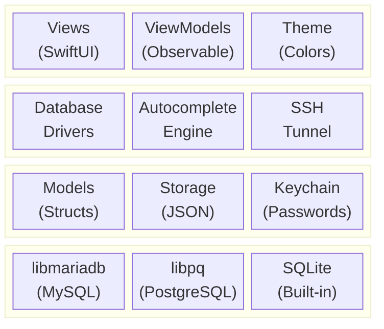
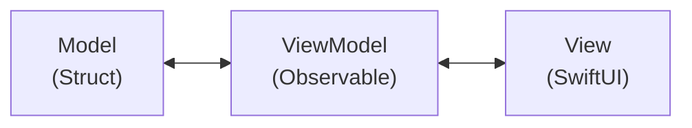
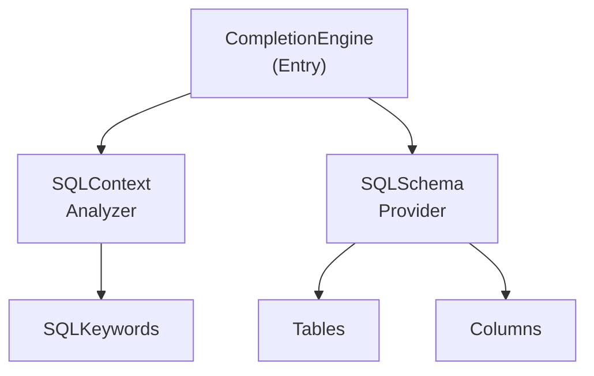
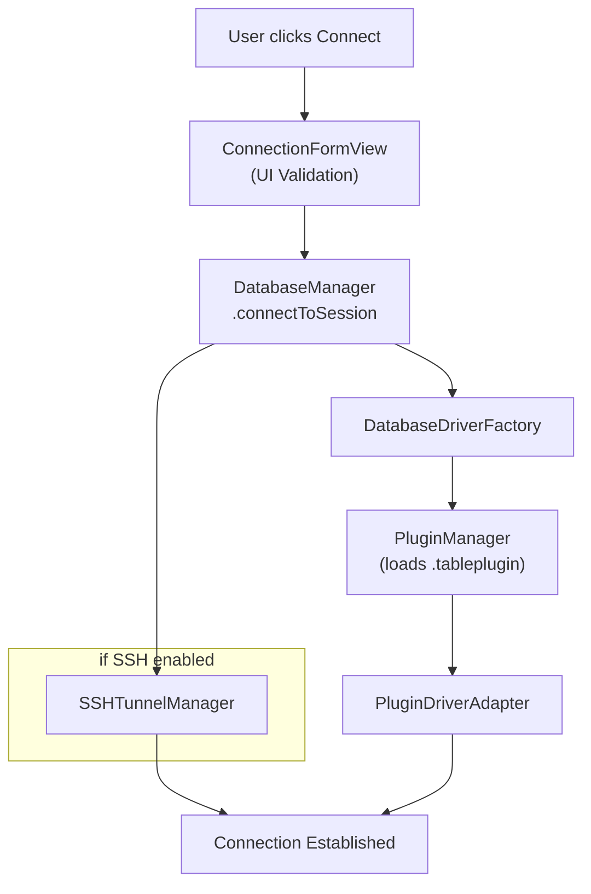
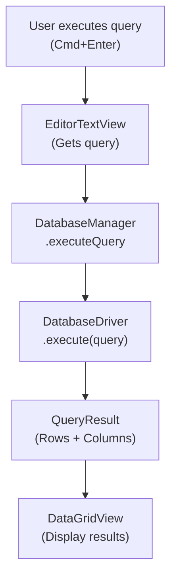

# Architecture

TablePro is built with:

- **SwiftUI** for the UI
- **AppKit** for low-level macOS integration
- **Swift Concurrency** (async/await, actors) for concurrent operations
- **Native C libraries** for database connectivity



## Dependencies

SPM dependencies:

| Package | Version | Purpose |
|---------|---------|---------|
| **CodeEditSourceEditor** | 0.15.2+ | Tree-sitter-powered code editor for the SQL editor |
| **Sparkle** | 2.x | Auto-update framework with EdDSA signing |

<Note>
CodeEditSourceEditor bundles a SwiftLint plugin that requires `-skipPackagePluginValidation` for CLI builds. See [Building](/development/building).
</Note>

## Directory Structure

<Tree>
  <Tree.Folder name="TablePro" defaultOpen>
    <Tree.Folder name="Core">
      <Tree.Folder name="Database">
        <Tree.File name="DatabaseDriver.swift" />
        <Tree.File name="DatabaseManager.swift" />
      </Tree.Folder>
      <Tree.Folder name="Plugins">
        <Tree.File name="PluginManager.swift" />
        <Tree.File name="PluginDriverAdapter.swift" />
      </Tree.Folder>
      <Tree.Folder name="Autocomplete" />
      <Tree.Folder name="Services" />
      <Tree.Folder name="SSH" />
    </Tree.Folder>
    <Tree.Folder name="Views" />
    <Tree.Folder name="Models" />
    <Tree.Folder name="ViewModels" />
    <Tree.Folder name="Extensions" />
    <Tree.Folder name="Theme" />
    <Tree.Folder name="Resources" />
  </Tree.Folder>
  <Tree.Folder name="Plugins" defaultOpen>
    <Tree.Folder name="TableProPluginKit" />
    <Tree.Folder name="MySQLDriverPlugin" />
    <Tree.Folder name="PostgreSQLDriverPlugin" />
    <Tree.File name="..." />
  </Tree.Folder>
  <Tree.Folder name="Libs" />
  <Tree.Folder name="TableProTests" />
  <Tree.Folder name="scripts" />
</Tree>

## Design Patterns

### MVVM Architecture



Models are structs, ViewModels are `@Observable`/`ObservableObject` classes, Views are SwiftUI.

### Protocol-Oriented Design

All database drivers conform to a single protocol:

```swift
protocol DatabaseDriver: AnyObject {
    var connection: DatabaseConnection { get }
    var status: ConnectionStatus { get }

    func connect() async throws
    func disconnect()
    func execute(query: String) async throws -> QueryResult
    func fetchTables() async throws -> [TableInfo]
    // ...
}
```

Database drivers are implemented as `.tableplugin` bundles loaded at runtime. Each plugin implements `DriverPlugin` and `PluginDatabaseDriver` from the shared `TableProPluginKit` framework. `PluginDriverAdapter` bridges `PluginDatabaseDriver` to the core `DatabaseDriver` protocol.

### Actor Isolation

Concurrent operations use Swift actors:

```swift
actor SSHTunnelManager {
    static let shared = SSHTunnelManager()

    private var tunnels: [UUID: SSHTunnel] = [:]

    func createTunnel(
        connectionId: UUID,
        sshHost: String,
        // ...
    ) async throws -> Int {
        // Thread-safe tunnel management
    }
}
```

### Plugin System

Driver creation uses a plugin-based factory. `PluginManager` discovers and loads `.tableplugin` bundles at runtime. `DatabaseDriverFactory` looks up plugins via `DatabaseType.pluginTypeId` and wraps them with `PluginDriverAdapter` to conform to the core `DatabaseDriver` protocol. No switch statement or hardcoded driver list is needed.

## Key Components

### Database Driver Plugins

Each driver is a `.tableplugin` bundle under `Plugins/`. MySQL, PostgreSQL, SQLite, ClickHouse, MSSQL, and Redis are built into the app bundle; the rest are distributed via the plugin registry and downloaded on demand.

| Plugin | Database Types | C Bridge | Distribution |
|--------|---------------|----------|--------------|
| MySQLDriverPlugin | MySQL, MariaDB | CMariaDB (libmariadb) | Built-in |
| PostgreSQLDriverPlugin | PostgreSQL, Redshift | CLibPQ (libpq) | Built-in |
| SQLiteDriverPlugin | SQLite | Foundation sqlite3 | Built-in |
| ClickHouseDriverPlugin | ClickHouse | URLSession HTTP | Built-in |
| MSSQLDriverPlugin | SQL Server | CFreeTDS | Built-in |
| RedisDriverPlugin | Redis | CRedis | Built-in |
| MongoDBDriverPlugin | MongoDB | CLibMongoc | Registry |
| DuckDBDriverPlugin | DuckDB | CDuckDB | Registry |
| OracleDriverPlugin | Oracle | OracleNIO (SPM) | Registry |
| CassandraDriverPlugin | Cassandra, ScyllaDB | CCassandra | Registry |
| EtcdDriverPlugin | Etcd | gRPC/HTTP | Registry |
| CloudflareD1Plugin | Cloudflare D1 | URLSession HTTP | Registry |
| DynamoDBDriverPlugin | DynamoDB | AWS SDK | Registry |
| BigQueryDriverPlugin | BigQuery | URLSession REST | Registry |

### Autocomplete Engine



- **CompletionEngine**: Main entry point
- **SQLContextAnalyzer**: Parses query context
- **SQLSchemaProvider**: Provides schema information
- **SQLKeywords**: SQL keyword definitions

## Data Flow

### Connection Flow



### Query Execution Flow



## State Management

| Pattern | What | Where |
|---------|------|-------|
| `@Published` | UI state (sessions, active tab) | ViewModels |
| `@AppStorage` | User preferences | Settings |
| Keychain | Passwords | ConnectionStorage |
| SQLite FTS5 | Query history | QueryHistoryStorage |
| JSON files | Tab state | TabStateStorage |

Tests live in `TableProTests/`. Run with `xcodebuild test -skipPackagePluginValidation`.

